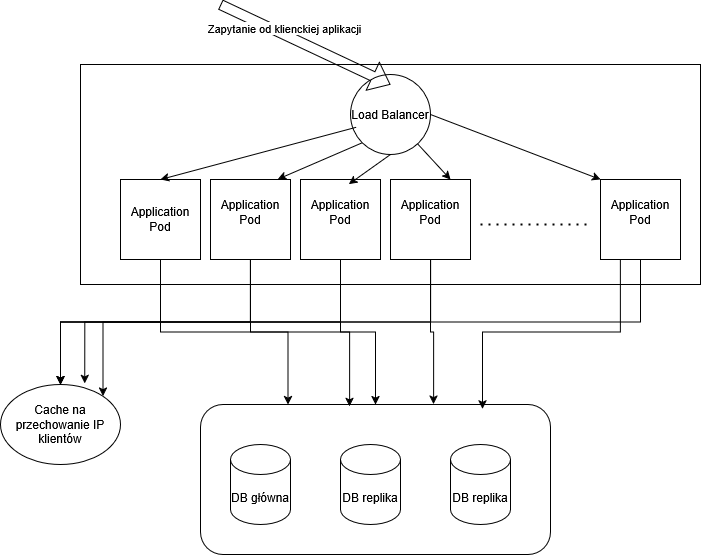

# Zadanie rekrutacyjne

## Opis zadania

Celem zadania jest zaprojektowanie i zaimplementowanie REST-owego serwisu odpowiedzialnego za
zarządzanie kuponami rabatowymi. System powinien udostępniać następujące funkcjonalności:

- rejestrację użycia kuponu przez użytkownika,
- tworzenie nowego kuponu (obsługa uwierzytelniania nie jest wymagana).

Każdy kupon powinien zawierać następujące informacje:
- unikalny kod kuponu,
- datę utworzenia,
- maksymalną liczbę możliwych użyć,
- bieżącą liczbę użyć,
- kraj, dla którego kupon jest przeznaczony.

Wymagania biznesowe:
- Kod kuponu powinien być unikalny, wielkość znaków nie ma znaczenia (WIOSNA i wiosna
traktujemy jak ten sam).
- Wykorzystanie kuponu powinno być limitowane maksymalną liczbą użyć - kto pierwszy ten
lepszy.
- Kraj zdefiniowany w kuponie ogranicza użycie kuponu tylko do osób z danego kraju (na
podstawie adresu IP - można wykorzystać dowolną darmową usługę do tego).
- Gdy kupon osiągnął maksymalną liczbę zużyć, próby użycia go powinny zwracać stosowną
informację w zwrotce. Tak samo, gdy podany kod kuponu nie istnieje, próba zużycia
przychodzi z niedozwolonego kraju lub użytkownik zużył już dany kupon.
- (Opcjonalnie, dla chętnych) Jeden użytkownik może wykorzystać kupon tylko raz – request
powinien zawierać identyfikator użytkownika (dowolny) oraz kod kuponu do wykorzystania.

Rozwiązanie powinno byś skalowalne. Dane powinny być zapisywane w bazie danych. Serwis
powinien być zaimplementowany w Java lub Kotlin. Projekt powinien być możliwy do zbudowania za
pomocą Maven lub Gradle. Możesz wspierać się dowolnymi, łatwo dostępnymi technologiami (silniki
BD, biblioteki, frameworki).

Przygotowując rozwiązanie zadania, pamiętaj, że zależy nam nie tylko na działającym kodzie, ale
również na jego jakości i podejściu do projektowania. Oczekujemy, że zaprezentujesz styl pracy jak
najbardziej zbliżony do tego, jakbyś realizował zadanie w realnym projekcie produkcyjnym.
Zachęcamy do stosowania dobrych praktyk programistycznych, przemyślanej architektury,
odpowiednich wzorców projektowych oraz rozwiązań technologicznych, które pokazują Twoje
zrozumienie tworzenia oprogramowania gotowego do wdrożenia. Unikaj uproszczonych
implementacji tworzonych jedynie na potrzeby spełnienia minimalnych wymagań zadania.
Cenimy przejrzystość, czytelność i jakość kodu, a także uwzględnienie kontekstu, że dany system
mógłby funkcjonować w wielowątkowym środowisku produkcyjnym.
Zależy nam na tym, aby kod był tworzony samodzielnie, bez wspomagania sztuczną inteligencją.
Prosimy o umieszczenie projektu na dowolnym repozytorium i udostępnienie nam linku.

## Rozwiązanie

### Struktura kodu

Projekt jest zbudowany w oparciu o Spring Boot i wykorzystuje Spring Data JPA do interakcji z bazą danych (H2). 
Serwis udostępnia REST API do zarządzania kuponami rabatowymi, umożliwiając ich tworzenie oraz rejestrację użycia przez użytkowników.
Projekt zawiera następujące warstwy:

- **Model**: Reprezentuje encję `Coupon`, która zawiera wszystkie wymagane pola.
- **Repozytorium**: Interfejs `CouponRepository` rozszerzający `JpaRepository`, umożliwiający operacje CRUD na kuponach.
- **Serwisy**:
  - `CouponService` zawiera logikę biznesową do tworzenia kuponów i rejestrowania ich użycia.
  - `GeolocationService` wykorzystuje zewnętrzne API do sprawdzania kraju użytkownika na podstawie adresu IP.
- **Fasada**:
  - `CouponManagementFacade` łączy logikę serwisów, zapewniając prosty interfejs do zarządzania kuponami.
- **Kontrolery**:
  - `AdminController` umożliwia tworzenie nowych kuponów.
  - `CustomerController` umożliwia rejestrowanie użycia kuponów przez użytkowników.
  - `GlobalExceptionHandler` obsługuje wyjątki i zwraca odpowiednie komunikaty błędów.

Dane wewnątrz aplikacji dotyczące kuponów przenoszone są poprzez DTO-sy (Data Transfer Object), co pozwala na oddzielenie warstwy prezentacji od warstwy logiki biznesowej.
Projekt zawiera także wybrane testy jednostkowe, które sprawdzają logikę biznesową oraz poprawność działania kluczowych komponentów aplikacji.

Jednym z założeń projektu była skalowalność. W związku z tym w encji `Coupon` zastosowałem
tzw. optimistic locking (adnotacja `@Version`), co pozwala na uniknięcie problemów związanych z race conditionami.
Oczywiście w wersji obecnej aplikacja oparta jest na bazie H2, natomiast docelowo powinna być postawiona osobna instancja relacyjnej bazy danych
(np. PostgreSQL albo SQL Server), która będzie przechowywała dane o kuponach. Wraz z tym należałoby też do build.gradle dorzucić
odpowiednią zależność do sterownika bazy danych, tak żeby Hibernate mógł się z nią komunikować.

### Uruchomienie projektu

Aby uruchomić projekt, należy wykonać następujące kroki:
1.Zbudować projekt za pomocą Gradle:
   ```bash
   ./gradlew build
   ```
2. Uruchomić aplikację:
   ```bash
    ./gradlew bootRun
    ```
3. Aplikacja będzie dostępna pod adresem `http://localhost:8080`.

### Specyfikacja API

Swagger -> http://localhost:8080/swagger-ui/index.html

Aby przetestować API, można użyć narzędzia takiego jak Postman lub curl. Poniżej znajdują się przykłady zapytań:
#### Tworzenie nowego kuponu
```http
POST /admin/coupon
Content-Type: application/json

{
  "code": "WIOSNA2023",
  "maxUses": 100,
  "country": ["PL"]
}
``` 

#### Rejestrowanie użycia kuponu
```http
POST /customer/coupon/{id}/remaining-uses
```

### Co można byłoby zrobić dalej?

#### Uwierzytelnianie i autoryzacja
- Nowy endpoint - dodawanie użytkowników
- **Uwierzytelnianie i autoryzacja**: Implementacja mechanizmów uwierzytelniania użytkowników oraz autoryzacji dostępu do niektórych endpointów.
   - Do tego celu użyłbym Spring Security. Dodatkowo należałoby doimlepentować obsługę JWT, aby zautoryzować użytkownika w kolejnych requestach.
  - Należałoby również rozszerzyć model:
    - Nowa encja `User` z unikalnym identyfikatorem i innymi danymi użytkownika.
      - W encji `Coupon` dodałbym pole w postaci listy użytkowników, którzy już wykorzystali dany kupon.
  - Mając rozszerzony model, trzeba byłoby dodać w serwisie logikę, która sprawdzałaby, kto już wykorzystał dany kupon i czy użytkownik może go jeszcze wykorzystać.
  - Poszczególne endpointy musiałyby sprawdzać JWT i autoryzować użytkownika przed wykonaniem operacji.

#### Cachowanie IP-ków użytkowników

Najprawdopodobniej będą użytkownicy, którzy będą korzystać bardzo często z kuponów. W takim przypadku warto byłoby cachować IP-ków użytkowników, aby nie wykonywać za każdym razem zapytań do zewnętrznego API w celu sprawdzenia kraju użytkownika.
Do tego sprawdziłbym, jak wykorzystać Spring Data Redis.

#### Deployment / Skalowanie

Kolejne kroki, które można byłoby wykonać to:
- Dockeryzacja aplikacji
- Stworzenie Helm chartu do deploymentu aplikacji na Kubernetesie
  - Horizontal Pod Autoscaler, który będzie skalował aplikację w zależności od obciążenia
  - Metryką do skalowania mogłaby być liczba requestów do endpointu rejestrującego użycie kuponu.
  - Do dorzucenia observability do kodu rozważyłbym Micrometer
- Kubernetes:
  - Potrzebny byłby Load Balancer (np. nginx), który będzie kierował ruch do aplikacji na wyskalowane pody.



